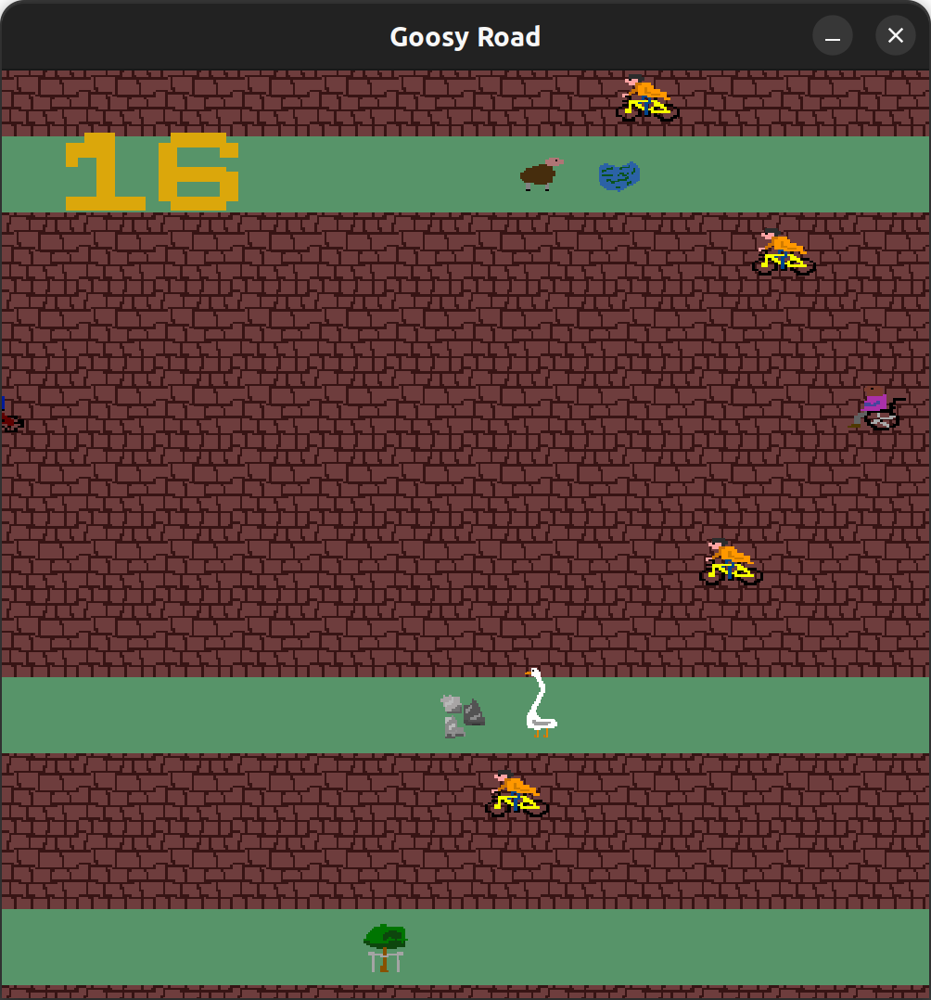

# Goosy Road!



The game written in GAS x64 assembly, about a goose which does stuff!

You will need to have sdl2, ttf sdl2 and image sdl2 installed! (on Ubuntu: ```apt install -y libsdl2-2.0-0 libsdl2-image-2.0-0 libsdl2-ttf-2.0-0```)

To run: clone (```git clone```), compile (```make```) and then execute (```./goosyRoad```)

P.S. Should work only on linux, so yeah, sad for Win users with no VM

P.P.S. I spent much more time on it than I wanted, but after all this time it is finally done!

P.P.P.S. There is a bunch of memory leaks, but I do not really care because in total that do not really contribute to the memory consumption.

P.P.P.P.S. I have not though about optimization while coding, so that is why it is soooo slow. Though if you use anything with at least a bit of performance, it should work fine.
